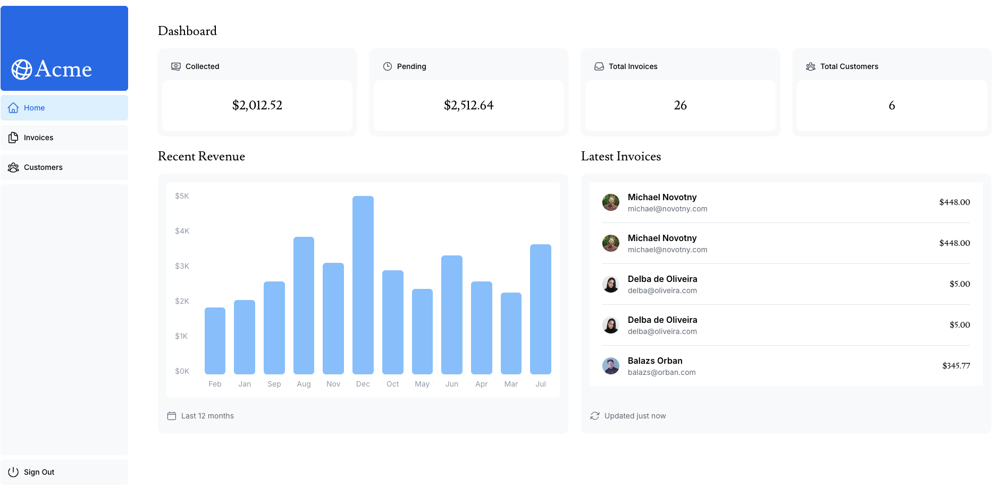
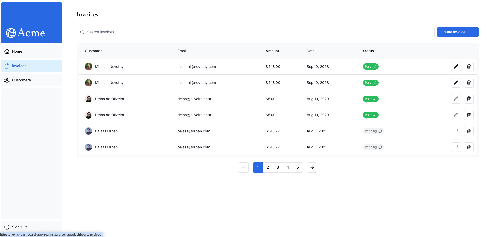

# Next.js Dashboard App

이 프로젝트는 Next.js 공식 Learn 과정의 Dashboard App 코스를 그대로 따라
학습하면서, 배포와 데이터베이스 연결, 인증, 접근성, 오류 처리까지 직접
구현해 본 포트폴리오용 학습 프로젝트입니다.

## 프로젝트 개요

- Next.js App Router 기반 대시보드 애플리케이션
- 서버 컴포넌트, 서버 액션, 스트리밍, 검색/페이지네이션 학습
- NextAuth.js를 이용한 로그인 인증 구현
- Vercel 배포와 PostgreSQL 기반 데이터베이스 연결 경험 정리
- ESLint, Prettier, pnpm 기반 개발 환경 구성
- 공식 커리큘럼 이후 인보이스 폼 오류 처리와 로그인 예제 계정 안내 개선

## 화면 미리보기

### 대시보드



### 인보이스



### Vercel 프로젝트 관리 화면


## 학습 자료

- 공식 코스:
  [Next.js Learn - Dashboard App](https://nextjs.org/learn/dashboard-app/)
- 학습 진행:
  [Metadata](https://nextjs.org/learn/dashboard-app/adding-metadata) 장까지 진행 후,
  사용 중 불편했던 부분을 추가로 개선했습니다.
- 커리큘럼:
  [Next.js Learn](https://nextjs.org/learn)

## 작업 저장소

현재 작업은 아래 저장소에서 진행하고 있습니다.

- 현재 저장소:
  [rhj1216-1216/nextjs-dashboard-app](https://github.com/rhj1216-1216/nextjs-dashboard-app.git)
- 기존 저장소:
  [rhj1216-hochan06/nextjs-dashboard-app](https://github.com/rhj1216-hochan06/nextjs-dashboard-app)

처음에는 `rhj1216-hochan06` 계정의 저장소에서 작업했지만, Vercel 배포와
관련된 설정을 진행하면서 `rhj1216-1216` 계정의 저장소로 작업 위치를
변경했습니다. 저장소 계정은 달라졌지만 소유주는 동일합니다.

## 배포

Vercel을 통해 배포했습니다.

- 배포 URL:
  [https://nextjs-dashboard-app-roan-six.vercel.app/](https://nextjs-dashboard-app-roan-six.vercel.app/)
- Vercel 프로젝트 관리 화면:
  [https://vercel.com/ryuhojin-s-projects/nextjs-dashboard-app](https://vercel.com/ryuhojin-s-projects/nextjs-dashboard-app)
- 데이터베이스:
  Vercel에서 제공하는 PostgreSQL 기반 데이터베이스를 연결했습니다.

### Vercel 사용 경험

이 프로젝트에서는 GitHub 저장소와 Vercel 프로젝트를 연결해 배포 흐름을 구성했고,
배포 환경에서 필요한 환경 변수와 PostgreSQL 기반 데이터베이스 연결을 직접
설정했습니다. 로컬 개발 환경과 배포 환경에서 인증, 데이터 조회, 시드 데이터
동작이 다르게 보일 수 있는 부분도 확인하면서 배포 이후의 검증 과정을 함께
경험했습니다.

포트폴리오 관점에서는 단순히 화면을 만든 것뿐 아니라, GitHub 저장소 연결,
Vercel 배포, 환경 변수 관리, 데이터베이스 연결, 배포 후 동작 확인까지 전체
웹 애플리케이션 배포 흐름을 직접 다뤄본 프로젝트로 정리할 수 있습니다.

## 실행 방법

```bash
pnpm i
pnpm dev
```

개발 서버를 실행할 때는 Node.js 22.21.1 환경을 사용합니다.

```bash
nvm use 22.21.1
pnpm dev
```

## 포맷팅

저장 시 Prettier가 자동 적용되도록 VS Code 워크스페이스 설정을 포함하고
있습니다.

```bash
pnpm format
pnpm format:check
```

## 공식 코스와 달랐던 부분

공식 코스를 따라가면서 대부분의 흐름은 동일하게 진행했지만, 실제 로컬 환경과
패키지 버전 차이 때문에 일부 과정은 다르게 처리했습니다.

### Node.js 버전

현재 프로젝트는 Next.js 16 계열을 사용하고 있어 Node.js 22.21.1 환경에서
실행했습니다. 로컬 기본 Node.js가 14 계열로 잡히면 `??=` 같은 최신 문법을
해석하지 못해 `pnpm dev`, `pnpm build`, `pnpm lint`가 실패할 수 있습니다.

따라서 명령어 실행 전 아래처럼 Node.js 버전을 맞춰야 합니다.

```bash
nvm use 22.21.1
```

### pnpm build script 승인

`pnpm add -D eslint eslint-config-next` 실행 중 `unrs-resolver`의 build script가
차단되는 경고가 발생했습니다. pnpm 최신 버전은 보안을 위해 일부 의존성의 설치
후 스크립트 실행을 자동으로 허용하지 않기 때문입니다.

이 프로젝트에서는 `pnpm approve-builds`로 승인한 결과가
`pnpm-workspace.yaml`에 반영되어 있습니다.

### ESLint 설정 파일

공식 코스 13장에서는 ESLint flat config 방식의 `eslint.config.mjs`를 사용합니다.
ESLint 9 이상부터는 기본 설정 파일로 `.eslintrc.*`가 아니라
`eslint.config.js`, `eslint.config.mjs`, `eslint.config.cjs`를 찾기 때문에,
설정 파일이 없으면 `pnpm lint` 실행 시 설정 파일을 찾지 못하는 오류가 발생합니다.

이 프로젝트에는 공식 문서 형태에 맞춰 `eslint.config.mjs`를 추가했습니다.

### ESLint 버전

처음 설치 시점에는 `eslint 10.4.0`이 설치되었지만,
`eslint-config-next 16.2.6`과 함께 실행했을 때 React ESLint 플러그인 내부 API
호환성 문제가 발생했습니다. 그래서 현재는 Next.js 설정과 안정적으로 동작하는
`eslint 9.39.4`를 사용하도록 조정했습니다.

### seed 라우트

`/seed` 라우트에서 `uuid-ossp` PostgreSQL extension을 여러 seed 함수가 동시에
생성하려고 하면서 중복 생성 오류가 발생했습니다. 이를 방지하기 위해 extension
생성은 한 번만 실행하고, 이후 테이블과 샘플 데이터를 순차적으로 넣도록
정리했습니다.

## 공식 커리큘럼 외 개선 사항

공식 코스를 그대로 따라가는 것과 별개로, 실제 사용 중 불편하게 느껴진 부분은
작은 단위로 추가 개선했습니다.

### 인보이스 폼 오류 표시 개선

인보이스 생성/수정 폼에서 서버 검증 오류가 발생한 뒤 입력값을 수정해도 기존
오류 문구가 계속 남아 있어 사용자 경험이 어색했습니다. 입력값을 변경하면 이전
오류 문구를 숨기고, 다시 제출했을 때 최신 서버 검증 결과만 보여주도록
정리했습니다.

또한 생성/수정 폼 모두 제출 중 상태를 `aria-disabled`로 반영해 접근성 상태도
함께 맞췄습니다.

### 로그인 예제 계정 안내

이 프로젝트는 학습용 예제이므로 로그인 화면에서 테스트 계정을 쉽게 확인할 수
있도록 정보 아이콘과 토글형 Popover를 추가했습니다. 아이콘을 클릭하면 예제
아이디와 비밀번호가 표시되고, 외부를 클릭하면 닫히도록 구현했습니다.

### 로그인 자동완성 속성 정리

Chrome에서 로그인 시 비밀번호 변경/저장 확인창이 과하게 뜨는 현상을 줄이기
위해 로그인 이메일 입력에는 `autocomplete="username"`, 비밀번호 입력에는
`autocomplete="current-password"`를 지정했습니다.
